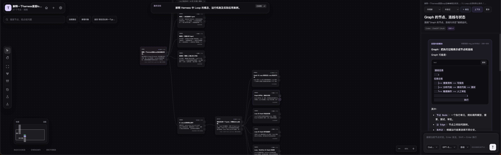

# Thought Canvas — 可分支的 AI 对话与知识画布

<p align="center">
  <a href="README.md"></a>
  <a href="README.zh-CN.md"></a>
  <a href="README.ja.md"></a>
</p>

Thought Canvas 是一个本地优先的可视化 AI 对话工具和知识管理工作台。它把线性聊天变成可以分支、回溯、比较和整理的思考画布：围绕同一个问题让多个 AI 模型分别作答，比较共同认知与反对意见，综合成新的分支继续推演，最后导出 Markdown 进入 Obsidian、个人 Wiki 或其他长期知识库。

如果你正在寻找 **可分支 AI 对话、多模型答案比较、AI 思维导图、ChatGPT 对话整理、本地优先 AI 工具、Codex OAuth 客户端、Markdown/Obsidian AI 工作流**，这就是 Thought Canvas 要解决的问题。



> 截图展示了一个已经展开的思考图：中心问题向多个分支扩展，右侧面板保留当前节点的上下文、结构化内容和继续对话入口。

## 为什么做 Thought Canvas

大多数 AI 对话仍然是一条不断向下延伸的线。

当 AI 一次输出很长的内容时，阅读本身就很累；更麻烦的是，你通常会同时对其中几处产生疑问。在线性聊天里，只能选择一个问题继续追问。等这个分支聊深以后，之前记在脑子里的其他疑问往往已经被遗忘，重要观点也被埋在越来越长的上下文中。

单个模型还只会提供一种看问题的角度。面对研究或重要决策，你可能希望 Codex、ChatGPT、Claude、Gemini、DeepSeek 或其他模型回答同一个问题。过去需要在多个聊天窗口之间复制问题、手工比较答案，最后的结论也很难追溯到各自来源。

Thought Canvas 想把这个过程改成一张真正可操作的思考地图：

- 对回答里的任意一处单独追问，每个问题都保留自己的上下文和分支；
- 随时回到尚未处理的疑问，不让它们因为对话变长而消失；
- 从同一上下文出发，让不同 AI 模型分别回答同一个问题；
- 比较多个答案的共同结论、真正分歧、隐含假设和独有价值；
- 将共同认知和反对意见综合成可追溯的新节点，并把它作为下一轮讨论的分支；
- 把观点、证据、假设、风险和行动从长回答中提取出来；
- 将阶段性结果导出为 Markdown，放进 Obsidian Vault 或个人 Wiki，交给后续 AI 工作流继续整理和维护。

最终形成一个闭环：

```text
提出问题
    → 拆出多个疑问
    → 多个 AI 模型从相同上下文分别作答
    → 比较共同认知、反对意见与隐含假设
    → 综合成新分支并继续推演
    → 导出 Markdown 到 Obsidian / Wiki
    → 成为下一轮研究与写作的长期上下文
```

它不是为了让 AI 再多说一点，而是为了让人能读得动、问得清、找得回、比得明白，并把一次性聊天变成可以长期积累的个人知识。

## 亮点

- **把长回答拆成可管理的问题**：选中回答中的任意内容，创建独立问题、观点、证据、假设、方案、风险、行动或决策。
- **多分支并行追问**：每个疑问都有自己的对话路径；聊完一个分支，还能回到其他尚未解决的疑问。
- **同题多模型作答**：从相同的问题和上下文创建并列分支，分别选择不同供应商或模型，保留公平、可追溯的比较基础。
- **把共识与反对意见变成下一条分支**：选择多个答案生成综合节点，明确共同点、真正分歧、背后假设、未解决问题和下一步，然后从该节点继续对话。
- **从聊天到 Obsidian/Wiki**：把思考过程和阶段性结论导出为 Markdown，进入已有知识库，而不是被锁在聊天产品里。
- **本地优先**：项目、设置、恢复版本和导出文件都保存在本机；服务默认只监听 `127.0.0.1`。
- **启动即检测本机 Codex OAuth**：启动后在后台启动本机 `codex app-server`，读取 Codex CLI 当前的 ChatGPT 登录状态和可用模型，自动同步到模型选择器。
- **精确分支**：从任意消息时点创建分支，不会把截止点之后的消息静默带入新分支。
- **上下文可审计**：每次生成都引用不可变上下文快照，可以查看“模型会看到什么”。
- **结构化推理**：维护观点、证据、假设、风险与决策之间的“支持 / 反驳 / 依赖”关系。
- **多供应商**：支持 Codex App Server、OpenAI Responses/Chat、DeepSeek、Anthropic、Gemini、常见 OpenAI 兼容服务和本地模型服务。
- **流式与恢复**：NDJSON 增量输出、停止生成、保留部分回答、同消息续写，以及最近 20 个恢复版本。
- **多语言界面**：简体中文、English、日本語；用户内容和模型原文不会被自动翻译。

## 快速开始

### 环境要求

- Node.js 18 或更高版本；
- 如需使用 Codex：安装支持 App Server 的官方 Codex CLI；
- 如需使用其他供应商：准备对应的 API Key 和 Base URL。

### 安装与启动

```bash
git clone https://github.com/genoooool/thought-canvas.git
cd thought-canvas
npm start
```

打开 [http://127.0.0.1:8787](http://127.0.0.1:8787)。

端口被占用时：

```bash
PORT=8790 npm start
```

也可以指定监听地址和 Codex 可执行文件：

```bash
HOST=127.0.0.1 PORT=8790 CODEX_BIN=/path/to/codex npm start
```

## Codex OAuth：启动后自动识别

Thought Canvas 不要求你把 ChatGPT/Codex Token 复制到网页、`.env.local` 或项目文件中。

启动流程：

1. 服务启动本机 `codex app-server`；
2. 通过 `account/read` 读取 Codex CLI 当前登录状态；
3. 如果已经登录，通过 `model/list` 读取账号可用模型；
4. 将模型与思考等级同步到 Thought Canvas 的选择器；
5. 如果尚未登录，可在“设置 → OAuth”中使用官方浏览器授权或设备码授权。

检测使用 `refreshToken: false`，不会主动刷新 Token。Thought Canvas 只保存账号类型、邮箱、套餐和模型目录等非敏感摘要；OAuth Token 仍由本机 Codex CLI 管理，不会写入项目 JSON、导出文件或 Git。

如果 Codex 不在 `PATH` 中，可以设置 `CODEX_BIN`。如果 CLI 版本过旧、不支持 App Server，设置页会显示明确的检测结果。

## 其他模型供应商

在“设置 → 供应商”中选择供应商，填写 API Key 后点击“连接并同步模型”。密钥只保存到本机 `.env.local`，不会进入浏览器存储、项目、备份或导出。

支持的协议包括：

- Codex App Server（ChatGPT OAuth）
- OpenAI Responses
- OpenAI Chat Completions
- Anthropic Messages
- Gemini `generateContent`

模型级思考等级会根据供应商能力和请求协议自动归一化。

## 核心工作流

1. 输入问题，选择供应商、模型和思考等级。
2. 选中值得追问或保留的文字，将其提升为问题、观点、证据、假设、风险、行动或决策。
3. 为不同疑问分别创建分支。
4. 需要比较模型时，从同一个问题创建并列分支，每个分支指定不同模型。
5. 选择这些回答并生成综合节点，提取共同认知、反对意见、隐含假设、独有价值、未解决问题和下一步。
6. 从综合节点继续对话，同时保留到所有来源答案的可追溯关系。
7. 导出 Markdown 放入 Obsidian Vault 或个人 Wiki，也可以导出完整 JSON、JSON Canvas，或恢复历史版本。

## 适合谁

- 经常使用 ChatGPT、Codex、Claude、Gemini 或 DeepSeek 做研究和复杂问题分析的人；
- 容易被 AI 长回答淹没，需要对多个局部问题分别追问的人；
- 希望比较多个模型，而不是只相信单一答案的人；
- 希望保留推理过程，而不只是复制最终答案的人；
- 使用 Obsidian、Markdown 或个人 Wiki 建立长期知识库的人；
- 需要比较方案、梳理证据、记录风险并形成决策的人。

## 常见问题

### Thought Canvas 和普通 AI 聊天有什么区别？

普通聊天按时间顺序保存消息，Thought Canvas 按问题和上下文分支组织对话。你可以从同一段回答拆出多个疑问，分别追问、比较，并在之后综合，而不会失去来源路径。

### 可以比较不同 AI 模型对同一个问题的回答吗？

可以。从同一个问题创建多个并列分支，为每个分支选择不同供应商或模型，然后选择这些答案进行综合。综合提示会明确区分共同结论、真正分歧、背后假设、独有洞见、未解决问题和下一步。生成的综合节点可以直接作为新分支继续讨论。

### 它是 AI 思维导图工具吗？

它包含思维导图式的可视化结构，但节点不是静态便签。每个节点都能携带对话、上下文快照、观点、证据、关系、模型信息和生成记录，因此更接近“可执行的 AI 推理图”。

### 可以配合 Obsidian 使用吗？

可以。将当前工作导出为 Markdown，再放入 Obsidian Vault、Git 管理的 Wiki 或其他 Markdown 知识库。当前采用导出工作流，不会在未经操作的情况下修改你的 Obsidian 仓库。

### 会读取或上传本机 Codex OAuth Token 吗？

不会。Thought Canvas 通过官方 Codex App Server 读取登录状态和模型目录，Token 仍由本机 Codex CLI 管理，不会进入项目文件、导出文件或 Git 仓库。

## 本地数据与安全边界

```text
.env.local                         供应商 API Key，仅本机
data/settings.local.json          非敏感设置与模型信息
data/runtime.local.json           当前活动项目
data/projects/*.json              完整本地项目
data/backups/*.json               最近 20 个恢复与迁移备份
```

这些文件已被 `.gitignore` 排除。其他边界：

- 默认只接受回环地址 Host；
- 写操作需要本次运行生成的会话令牌；
- 校验本地 Origin，拒绝跨来源写入；
- Codex 生成使用内置 `:read-only` 权限配置，旧版 App Server 只在明确兼容场景下回退到 `sandbox: "read-only"`；
- 授权头、Cookie、Token 等供应商敏感信息不会透传到前端。

## 开发与验证

```bash
# 语法检查与 Node/API 测试
npm run test:node

# 完整测试，包含 Chromium UI 测试
npm test

# 发布包扫描
npm run verify:package
```

测试覆盖界面语言、UTF-8 修复与迁移、Markdown 选区、分支和上下文快照、多分支综合、供应商能力、本地 API 边界、Codex OAuth/模型/流式/只读权限、浏览器交互、恢复和导出。

更多文档：

- [`START_HERE.md`](START_HERE.md)：最短启动与人工验收路径
- [`docs/ARCHITECTURE.md`](docs/ARCHITECTURE.md)：系统架构
- [`docs/MERGE_POLICY.md`](docs/MERGE_POLICY.md)：分支比较与综合策略
- [`docs/PROVIDER_CONFIG.md`](docs/PROVIDER_CONFIG.md)：供应商与模型配置
- [`docs/OAUTH_DECISION.md`](docs/OAUTH_DECISION.md)：Codex OAuth 边界
- [`docs/GATES.md`](docs/GATES.md)：可验证发布 Gate
- [`docs/TEST_REPORT.md`](docs/TEST_REPORT.md)：测试证据
- [`docs/KNOWN_LIMITATIONS.md`](docs/KNOWN_LIMITATIONS.md)：已知限制
- [`docs/ai/`](docs/ai/)：后续开发的项目记忆

## 项目结构

```text
index.html                 页面结构
styles.css                 视觉样式
app.js                     前端状态、画布交互和持久化
server.mjs                 本地 HTTP/API 服务与供应商路由
codex-app-server.mjs       Codex App Server JSONL 客户端
providers.js               内置供应商目录
provider-capabilities.js   模型与思考能力归一化
thinking-core.js           推理图核心数据结构
tests/                     Node、API、Codex 和浏览器测试
docs/                      设计、验收和研究文档
```

## 当前版本

当前应用版本为 **v12.6**，对应 `package.json` 中的 `1.2.6`。

## 许可

仓库当前未附带开源许可证。若要以特定开源许可证发布，请补充相应的 `LICENSE` 文件。
